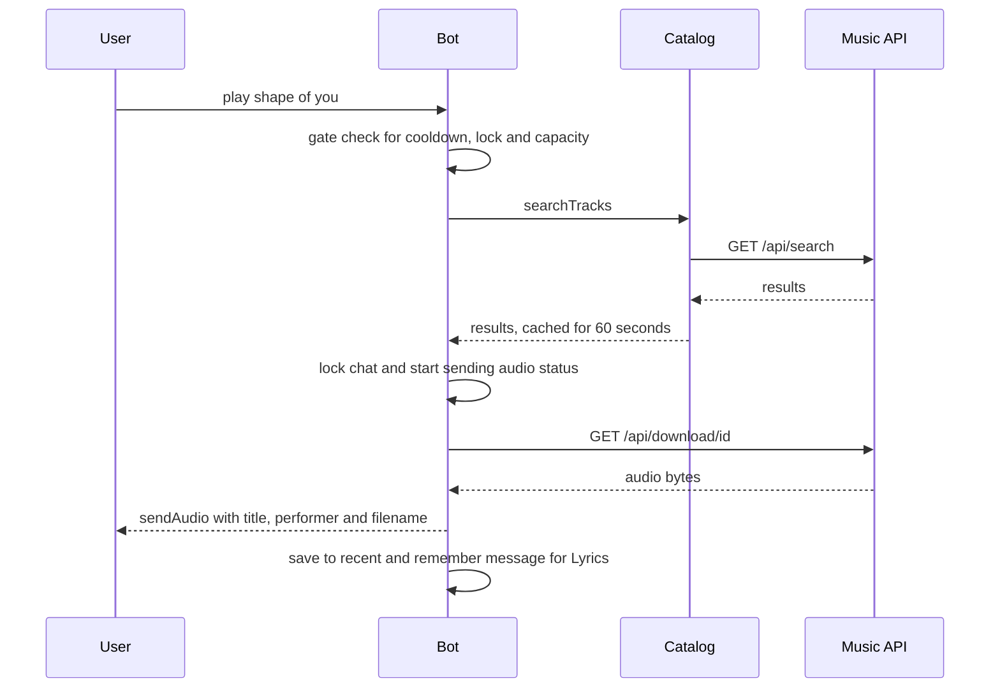
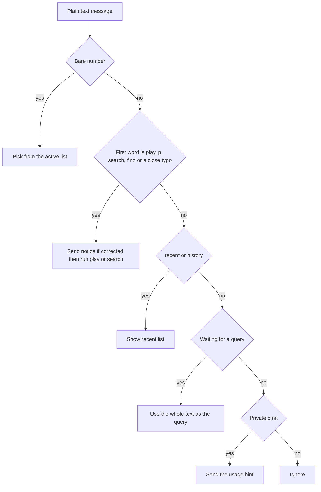

<div align="center">

# Music Bot for Telegram

**Type a song name and get the track back. Play instantly, pick from a list, replay what you played before, or search from any chat with inline mode. Includes a brutalist Mini App and a public docs page.**

[Release notes](#release-notes) · [Features](#features) · [User experience](#user-experience-guide) · [How it works](#how-it-works) · [Setup](#local-development) · [Deploy](#render-deployment) · [Telegram setup](#telegram-setup) · [Troubleshooting](#troubleshooting)


</div>

---

## At a glance

| | |
|---|---|
| **What it is** | A webhook-based Telegram bot plus a Mini App and docs page, served by one Express process |
| **Music source** | Three endpoints of one music API: search, lyrics, download (see [Music API contract](#music-api-contract)) |
| **State** | In memory only. No database. Recent history and lists reset on restart |
| **Runtime** | Node.js 18+, CommonJS, no build step |
| **Deploy target** | Render (Docker or Blueprint), works on any host that can run Node and expose HTTPS |
| **Tests** | 94 tests with the built-in `node:test` runner, no test dependencies |

> [!IMPORTANT]
> `song.id` from the search response is assumed to be the same ID the download endpoint expects. This was traced from a working reference module and could not be verified against the live API from the build environment. If audio never arrives after you tap a result, start with [Troubleshooting #3](#troubleshooting).

## Release notes

### 2.0.1

**Fixed**

- Opening the service URL in a browser showed raw status JSON. The root URL now shows the public docs page to browsers, while `curl`, uptime monitors and other API clients still get the status JSON. The response varies on the `Accept` header.
- A Mini App configured with the bare service URL now forwards to `/app` automatically and keeps Telegram's launch parameters. In 1.x the root URL happened to serve the Mini App, so some setups pointed BotFather at it. Setting the BotFather URL to `/app` is still the correct setup.

**Added**

- The docs page has an **Open in Telegram** button (needs `BOT_USERNAME`) and an **Open the Mini App** button.
- `MINI_APP_PATH` and `DOCS_PATH` are validated. Only simple paths such as `/app` or `/tools/music` are accepted, anything else falls back to the default.
- 14 new tests, 94 in total.

**Changed**

- The docs page moved from `public/docs.html` to `src/views/docs.html` and is now a template filled from your configuration. The raw template is no longer downloadable as a static file.
- The version in the status JSON is now `2.0.1`.

### 2.0.0

**Added**

- **Recently played**: `/recent`, or just type `recent` or `history`. Last 10 tracks per chat, newest first, deduplicated, one tap to replay.
- **Inline mode**: type the bot's username and a song in any chat. Results are audio entries backed by a short-lived search cache.
- **Richer captions**: a duration line appears when the API supplies one. See [Caption details](#caption-details) for exactly what is guaranteed.
- **Rate limiting**: a per-chat cooldown, a per-chat one-download-at-a-time lock, and a global concurrent-download cap that protects small hosts.
- **Typo tolerance**: `plya`, `serach`, `fnid` and similar still work, with a visible notice. Ordinary English words are never rewritten.
- **Bot profile sync**: on startup the bot registers its command menu, short description and description with Telegram (best effort, can be turned off).
- **Tests and CI**: 80 tests, plus a GitHub Actions workflow that runs them on Node 18, 20 and 22.
- **Configuration**: the music API host, cooldown, concurrency cap, audio size cap and profile sync are now environment variables.

**Fixed**

- `GET /` returned the Mini App page instead of status JSON because static file serving shadowed the route.
- Lyrics longer than Telegram's message limit failed to send. They are now split into several messages at line boundaries.
- `/lyrics Jay-Z - 99 Problems` split on the hyphen inside the artist name. The split now uses the first spaced dash only.
- Typing a word such as `constructor` before a query could be treated as a command through inherited object keys. Lookups now use `Map`.
- The Lyrics button always returned lyrics for the most recently played track. It now resolves the track belonging to the message you tapped.
- Search failures were reported as "no results". They now say the music service is not responding.
- Bare numbers and unrecognised text triggered replies in group chats. Groups are now silent unless the message is a real command.
- The Mini App status row claimed "API: Reachable" without checking anything. It now shows real upstream health from recent calls.
- Downloads that returned JSON or HTML with a 200 status were sent to Telegram as if they were audio. They are now rejected.
- The `.env.example` and `.gitignore` files were missing from the 1.x zip because the copy step skipped dotfiles. They are restored and covered by the file listing below.
- The 1.x setup steps said to fill in `.env` and run `npm start`, but nothing loads that file. [Local development](#local-development) now shows how to export it.

**Changed**

- The source tree is now layered: `clients`, `services`, `state`, `lib`, `handlers`, `routes`, `copy`, `constants`. See [Project layout](#project-layout).
- The container runs as the non-root `node` user and Render uses `/health` as its health check.
- `GET /api/status` gains `version` and `upstream` and no longer exposes the API host.

<details>
<summary><strong>Upgrading a fork: where old files went</strong></summary>

| 1.x path | 2.0 path |
|---|---|
| `src/api.js` | `src/clients/musicApi.js` |
| `src/helpers.js` | `src/lib/track.js` and `src/lib/format.js` |
| `src/messages.js` | `src/copy/messages.js` |
| `src/sessions.js` | `src/state/sessions.js` |
| `src/handlers/commands.js` | `src/handlers/commands/` (one file per command group) |
| `src/handlers/callback.js` | `src/handlers/callbacks.js` |
| `src/handlers/messages.js` | `src/handlers/plainText.js` |
| list and playback logic inside `commands.js` | `src/services/listing.js` and `src/services/playback.js` |

</details>

## Features

**Bot**

- Instant play with `/play`, `play <song>` or `p <song>`
- Pick-list search with `/search`, `search <song>` or `find <song>`, ten results per page
- The search message edits itself from "Searching..." into the list, so the chat stays tidy
- Tap a row or reply with its number to download
- Delete-list button that also clears the list from memory
- Recent history with replay
- Inline mode for any chat
- Lyrics by command or by the button under each track, correct for the message you tapped
- Personalised welcome using the Telegram first name
- Audio always uploaded with real title, performer and an `Artist - Title` filename
- Native "sending audio" status while a download is running

**Mini App**

- Brutalist design: thick black borders, hard offset shadows, one accent colour, rounded corners
- Search, help with tap-to-copy commands, and a status view
- Live uptime and a truthful upstream health indicator

**Docs page**

- Public page shown to browsers at the service URL (`/`) and at `DOCS_PATH`, describing commands, shortcuts, inline mode and how the bot works
- **Open in Telegram** and **Open the Mini App** buttons, filled in from your configuration

**Reliability and safety**

- Per-chat cooldown, per-chat lock with stale-lock recovery, global concurrency cap
- Handler guard: a crashing handler is logged, never an unhandled rejection
- Search cache with expiry and LRU eviction, idle-session pruning
- Group-safe behaviour, graceful shutdown on `SIGTERM`
- Payload validation on downloads (size cap, non-audio rejection)

**Developer experience**

- Layered structure with one responsibility per file
- Constants, copy and limits each live in exactly one place
- 94 tests, CI on three Node versions, `.editorconfig`, `.dockerignore`

## User experience guide

### Everyday flows

```text
You:  play perfect ed sheeran
Bot:  [audio  Ed Sheeran - Perfect.mp3  caption "Perfect / Ed Sheeran"  button "Lyrics"]

You:  search shape of you
Bot:  🔍 Searching shape of you on the music library...
Bot:  (same message, edited)
      Results for "shape of you"
      1-10 of 14
      Tap a track to download it, or reply with its number.
      [1. Shape of You — Ed Sheeran] ... [10. ...]
      [Next ▶]
      [🗑 Delete list]

You:  3
Bot:  [audio for result 3]

You:  recent
Bot:  🕘 Recently played  (newest first, tap to replay)

You:  plya despacito
Bot:  Assuming you meant "play".
Bot:  [audio]
```

### Inline mode in use

```text
In any chat:  @YourBot shape of you
Telegram:     shows up to 20 audio results while you type
You:          tap one, Telegram sends it to that chat
```

### Every situation and what the user sees

| Situation | Response |
|---|---|
| `/start` | Welcome addressed by first name, with the play, search and recent shortcuts |
| `/play` or `/search` with no query | A short prompt, and your **next plain message** becomes the query |
| Play succeeds | One audio message and a **Lyrics** button. No intermediate messages |
| Search succeeds | The searching message becomes the list, up to 10 rows plus Previous, Next and Delete |
| Reply with a number | Picks that item, but only numbers on the currently visible page |
| Typo in a shortcut word | `Assuming you meant "play".` then the normal result |
| `/recent` with history | `🕘 Recently played` list |
| `/recent` with no history | `Nothing played yet. Try: play shape of you` |
| Second request inside the cooldown | `⏳ Easy there — try again in Ns.` |
| Request while your last track is still sending | `⏳ Still sending your last track. One at a time!` |
| Bot at its global download cap | `🔥 The bot is busy with other downloads right now. Try again in a few seconds.` |
| Music service down or unreachable | `The music service isn't responding right now. Try again in a moment.` |
| Search finds nothing | `No results found for "<query>". Try a different search.` |
| Track larger than the size cap | `That track is bigger than the 20 MB limit this bot allows.` |
| Download failed or was not audio | `Download failed for <track>. Try again in a moment.` |
| Telegram rejected the upload | `Couldn't send <track> through Telegram.` followed by a direct link |
| Lyrics not found | `Couldn't find lyrics for that song. Double-check the artist and title.` |
| Tapped a list that was deleted or expired | `That list has expired. Start a new search with /search.` |
| Unrecognised text in a private chat | `Type play <song> to download instantly, or search <song> to see a list of matches.` |
| Unrecognised text in a group | Nothing. The bot stays quiet |

## Screenshots

Add your own captures under these paths and reference them here:

```text
docs/screenshots/chat-play.png
docs/screenshots/chat-search-list.png
docs/screenshots/chat-recent.png
docs/screenshots/inline-mode.png
docs/screenshots/miniapp-home.png
docs/screenshots/docs-page.png
```

## How it works

```text
                   ┌───────────────────────┐
                   │    Telegram servers    │
                   └───────────┬───────────┘
                               │ webhook POST /webhook/<secret>
                               ▼
                   ┌───────────────────────┐
                   │   Express  (app.js)    │
                   └───────────┬───────────┘
        ┌───────────┬──────────┴─┬──────────────┐
        ▼           ▼            ▼              ▼
  routes/webhook  routes/mini  routes/status  routes/docs
        │           │
        ▼           │
   bot.processUpdate│
        │           │
        ▼           │
  bot.js  (guarded event handlers)
        │           │
        ▼           │
  handlers/ ───────►│
   commands/*       │
   callbacks        │
   plainText        │
   inline           │
        │           │
        ▼           ▼
  services/  ◄──────┘
   catalog ─── cache ───┐
   listing              │
   playback             ▼
   lyrics        clients/musicApi ───► Music API
        │
        ▼
  state/sessions    lib/*    copy/messages    constants
```

### Play flow



### Plain text routing

Every non-command text message is routed in this order:



### Module responsibilities

| Layer | Files | Responsibility |
|---|---|---|
| Entry | `index.js`, `app.js`, `bot.js` | Bootstrap, HTTP app factory, event wiring with a crash guard |
| Handlers | `handlers/commands/*`, `callbacks.js`, `plainText.js`, `inline.js` | Translate Telegram events into service calls |
| Services | `catalog`, `listing`, `playback`, `lyrics`, `docsPage` | Business rules: caching, list rendering, admission gate, download and upload, docs page rendering |
| Clients | `clients/musicApi.js` | The only file that talks to the music API, with health tracking |
| State | `state/sessions.js` | Per-chat memory: active list, recent, lock, cooldown stamp, message to track map |
| Lib | `commandParser`, `typoTolerance`, `rateLimit`, `ttlCache`, `track`, `format`, `negotiate` | Pure functions with no I/O |
| Copy | `copy/messages.js` | Every user-facing string |
| Constants | `constants/index.js` | Callback IDs, limits, command menu, profile text |

## Project layout

```text
music-bot/
├── .github/workflows/ci.yml
├── public/
│   ├── index.html            Mini App shell
│   ├── styles.css            Brutalist theme
│   └── app.js                Mini App logic
├── scripts/
│   └── zip.js                Packages the project into dist/music-bot.zip
├── src/
│   ├── index.js              Bootstrap, webhook, profile sync, shutdown
│   ├── app.js                Express app factory
│   ├── bot.js                Bot factory and guarded event wiring
│   ├── config.js             Environment configuration
│   ├── constants/index.js
│   ├── clients/musicApi.js
│   ├── copy/messages.js
│   ├── lib/
│   │   ├── commandParser.js
│   │   ├── format.js
│   │   ├── negotiate.js
│   │   ├── rateLimit.js
│   │   ├── track.js
│   │   ├── ttlCache.js
│   │   └── typoTolerance.js
│   ├── services/
│   │   ├── catalog.js
│   │   ├── docsPage.js
│   │   ├── listing.js
│   │   ├── lyrics.js
│   │   └── playback.js
│   ├── state/sessions.js
│   ├── handlers/
│   │   ├── commands/
│   │   │   ├── general.js    start, help, app
│   │   │   ├── play.js
│   │   │   ├── search.js
│   │   │   ├── recent.js
│   │   │   ├── lyrics.js
│   │   │   └── index.js
│   │   ├── callbacks.js
│   │   ├── inline.js
│   │   └── plainText.js
│   ├── routes/
│   │   ├── docs.js
│   │   ├── mini.js
│   │   ├── status.js
│   │   └── webhook.js
│   └── views/
│       └── docs.html         Docs page template
├── test/
│   ├── support/
│   │   ├── mockBot.js
│   │   └── stubs.js
│   ├── concurrency.test.js
│   ├── config.test.js
│   ├── docsPage.test.js
│   ├── flows.test.js
│   ├── gate.test.js
│   ├── inline.test.js
│   ├── lib.test.js
│   ├── loadGraph.test.js
│   ├── musicApi.test.js
│   └── state.test.js
├── .dockerignore
├── .editorconfig
├── .env.example
├── .gitignore
├── Dockerfile
├── LICENSE
├── package.json
├── README.md
└── render.yaml
```

## Feature reference

### Instant play and pick-list search

`/play` searches and downloads the first result. `/search` shows a list. Both accept the same query and both are available without a slash, see the next section. The search message is edited in place, so `/search` never leaves an extra "Searching..." bubble behind. The list keeps ten items per page. The number you type must belong to the page currently visible.

### No-slash shortcuts

| You type | Meaning |
|---|---|
| `play <song>`, `p <song>` | Same as `/play` |
| `search <song>`, `find <song>` | Same as `/search` |
| `recent`, `history` | Same as `/recent` |
| a number | Pick that row from the current list |

If you send `/play` or `/search` with no query, the bot remembers which one you meant and treats your next plain message as the query. A shortcut prefix always wins over this, so typing `search something else` after a bare `/play` runs a search.

### Recently played

- Stored per chat in memory, capped at 10 entries, newest first
- Replaying a track moves it to the top instead of duplicating it
- Only tracks that were actually delivered are recorded, failed downloads are not
- Shown through the same list component as search, so paging, numbers and Delete list behave identically
- Cleared by a restart, and by 24 hours of chat inactivity

### Inline mode

Type `@YourBot <song>` in any chat. The bot answers with up to 20 audio results, drawn from the same cache as normal search, and Telegram sends the one you pick.

> [!NOTE]
> Inline results are URL based: Telegram downloads the audio from the music API itself. That is a Telegram platform rule, not a bot setting, and it means the clean `Artist - Title` filename used inside the bot chat cannot be applied here. Telegram may show the source file's own name. Telegram's own fetch also has time and size limits, so a slow API can produce results that fail to send. Inline mode is best effort, normal chat is the reliable path.

Requirements:

1. Enable inline mode in BotFather with `/setinline`, see [Telegram setup](#telegram-setup). Without it Telegram never sends inline queries and the feature silently does nothing.
2. `BOT_USERNAME` should be set so `/help` can show the inline hint.
3. Queries shorter than two characters get an empty answer.

### Caption details

The caption is always the track name and artist. A third line, `⏱ m:ss`, is added **only if** the API's song object has a `duration` field that is a positive number of seconds or a `m:ss` / `h:mm:ss` string. The reference module this bot was traced from never read a duration field, so on the current API the line most likely does not appear. It is a conditional enhancement, not a promise. Nothing else in the caption is inferred or invented.

### Rate limiting and fair use

Three independent layers, all checked before any download starts:

| Layer | Default | Env | Behaviour |
|---|---|---|---|
| Per-chat lock | one at a time | none | A second request while one is running gets the "Still sending" message. A lock older than 120 seconds is treated as stale and ignored, so a crash cannot block a chat forever |
| Per-chat cooldown | 3000 ms | `COOLDOWN_MS` | Measured from the moment the previous download started. `0` disables it |
| Global cap | 3 downloads | `MAX_CONCURRENT_DOWNLOADS` | Protects memory on small hosts. Each download is held in memory up to `MAX_AUDIO_MB` |

`/play` checks the gate before it searches, so a spammer does not cost search calls either.

### Typo tolerance

Applies only to the first word of a shortcut, and only to `play`, `search` and `find`.

| Corrected | Not corrected |
|---|---|
| swapped neighbours: `plya`, `serach`, `fnid` | ordinary words: `pay`, `plan`, `fine`, `kind`, `fond` |
| one extra letter: `plays`, `finds`, `searchh` | anything under 4 letters: `pla`, `pay` |
| one missing letter in `search`: `seach`, `sarch` | substitutions, because they collide with real words |

Whenever a correction happens the bot says so first: `Assuming you meant "play".` The rule is deliberately conservative, a false correction is worse than a missed one. The one-letter shortcut `p` is exact-match only.

### Group chats

- Slash commands work normally, including `/play@YourBot`
- Bare numbers and unrecognised text produce **no replies** in groups
- With Telegram's Group Privacy on (the default) bots do not receive plain group messages at all, so shortcuts and number replies need Privacy turned off or the bot made an admin. See [Telegram setup](#telegram-setup)
- The active list is shared by the whole group

### Lyrics

- `/lyrics <artist> - <title>` splits on the **first** ` - ` (space, dash, space), so `Jay-Z - 99 Problems` and `Ed Sheeran - Perfect - Live` both work
- The Lyrics button under a track resolves the track of the message you tapped, using a small per-chat memory of the last 30 delivered tracks
- Text longer than 4000 characters is split at line boundaries into several messages

### Search cache

Search results are cached for 60 seconds (up to 200 distinct queries, least recently used evicted first). Queries are normalised by trimming, lowercasing and collapsing spaces, so `Same   Query` and `same query` share one entry. This protects the music API from inline typing bursts and repeated searches. Failed searches are never cached.

### Bot profile sync

At startup the bot calls `setMyCommands`, `setMyShortDescription` and `setMyDescription`, so the `/` menu, the About text and the empty-chat description are filled without touching BotFather. It is best effort: each call is wrapped, a missing method or rejected call is logged and skipped. Set `SYNC_BOT_PROFILE=false` to stop the bot overwriting edits you make by hand.

## Music API contract

The ground truth this bot is built against, traced from a working reference implementation's request and response handling.

| Endpoint | Method | Response | Notes |
|---|---|---|---|
| `/api/search?query=` | `GET` | Bare JSON array of song objects | Each song `{ id, name, artist }`. A `404` is treated as "no results" |
| `/api/lyrics?artist=&title=` | `GET` | `{ lyrics: "..." }` | Blank or missing lyrics count as not found |
| `/api/download/<songId>` | `GET` | Raw audio bytes | The endpoint is the audio stream, there is no JSON wrapper |

Behaviours layered on top:

- The download client refuses payloads whose content type is JSON, HTML or text, and empty bodies
- Downloads larger than `MAX_AUDIO_MB` are aborted and reported with a specific message
- If the first search result has no usable `id`, one diagnostic line listing the fields present is logged, which is the fastest way to confirm the `song.id` assumption
- Upstream health (`ok`, `degraded`, `unknown`) is derived from the most recent call and shown in the Mini App

To point the bot at a different host, set `MUSIC_API_BASE`. It must expose the same three endpoints and shapes.

> [!WARNING]
> Make sure your use of the music API, and of the content it serves, complies with that service's terms and with copyright law where you operate. This project relays whatever the configured API returns.

## HTTP endpoints

### Server

| Method | Path | Purpose |
|---|---|---|
| `GET` | `/` | The docs page for browsers. Status JSON (`status`, `bot`, `version`, `time`) for everything else. Varies on `Accept` |
| `GET` | `/health` | Uptime JSON, used by the Render health check |
| `GET` | `/api/status` | `status`, `bot`, `version`, `uptime`, `uptimeMs`, `memory`, `sessions`, `upstream` |
| `POST` | `/webhook/<WEBHOOK_SECRET>` | Telegram update receiver |
| `GET` | `MINI_APP_PATH` (`/app`) | Mini App |
| `GET` | `DOCS_PATH` (`/docs`) | Docs page |

### Mini App proxy

| Method | Path | Purpose |
|---|---|---|
| `GET` | `/api/mini/search?q=` | Proxied search. `502` with `upstream_unavailable` when the music API is down |
| `GET` | `/api/mini/lyrics?artist=&title=` | Proxied lyrics |
| `GET` | `/api/mini/download-url?id=` | Direct download URL for a track ID |

## Configuration

| Variable | Required | Default | Description |
|---|---|---|---|
| `BOT_TOKEN` | Yes | none | Token from BotFather |
| `WEBHOOK_SECRET` | Yes | `changeme` | Secret path segment of the webhook URL. Change it |
| `PUBLIC_URL` | Yes | none | Public HTTPS base URL, no trailing slash |
| `BOT_USERNAME` | Recommended | none | Username with or without `@`. Used for the inline hint and status |
| `PORT` | No | `10000` | Listening port |
| `MINI_APP_PATH` | No | `/app` | Mini App route. Simple paths only (letters, digits, `-`, `_`, `/`), anything else falls back to the default |
| `DOCS_PATH` | No | `/docs` | Docs page route. Same path rules as `MINI_APP_PATH` |
| `MUSIC_API_BASE` | No | `https://raihan07-musicapi.vercel.app` | Music API host |
| `COOLDOWN_MS` | No | `3000` | Per-chat cooldown, `0` disables |
| `MAX_CONCURRENT_DOWNLOADS` | No | `3` | Global download cap, minimum 1 |
| `MAX_AUDIO_MB` | No | `20` | Largest file the bot will download. Telegram bots can upload up to 50 MB |
| `SYNC_BOT_PROFILE` | No | `true` | Register command menu and descriptions on startup |

Fixed limits live in `src/constants/index.js`:

| Limit | Value |
|---|---|
| Results per page | 10 |
| Recent history size | 10 |
| Track-per-message memory | 30 |
| Stale lock threshold | 120 s |
| Idle session lifetime | 24 h, pruned hourly |
| Search cache | 60 s, 200 entries |
| Message chunk size | 4000 characters |
| Inline results / minimum query / cache | 20 / 2 characters / 300 s |
| Sending-audio status refresh | every 4 s |

## Local development

1. Clone or unzip the project and enter the directory:
   ```bash
   cd music-bot
   ```
2. Install dependencies:
   ```bash
   npm install
   ```
3. Create your environment file:
   ```bash
   cp .env.example .env
   ```
4. Fill in `BOT_TOKEN`, `WEBHOOK_SECRET`, `PUBLIC_URL` and `BOT_USERNAME`. For local testing expose the server with a tunnel such as ngrok or Cloudflare Tunnel and use its HTTPS URL as `PUBLIC_URL`.
5. The app reads real environment variables and does not load `.env` by itself. Export them and start:
   ```bash
   set -a && . ./.env && set +a
   npm start
   ```
   On Node 20.6 or newer you can use `node --env-file=.env src/index.js` instead.
6. Watch the log for `webhook registered at ...` and, if profile sync is on, `synced command menu`.
7. Open the service URL in a browser for the docs page, `/app` for the Mini App, and run `curl` against the URL to see the status JSON.
8. Message the bot: `/start`, then `play shape of you` with no slash.

> [!TIP]
> Try `search shape of you` and tap a row as well as `play`. If one works and the other does not, compare the raw search response with the [Music API contract](#music-api-contract).

## Testing

```bash
npm test
```

The suite uses Node's built-in runner, so there is nothing extra to install. It covers the pure libraries, configuration parsing, session state, the music API client, every user flow through a recording mock bot, the admission gate, the global cap, inline mode, the docs page template and its Mini App forwarding script, and a smoke test that loads every module and checks command patterns and route mounting.

- Network and Telegram are never touched. `test/support/stubs.js` intercepts `axios`, `express` and `node-telegram-bot-api` at module load, `test/support/mockBot.js` records every bot call
- Each file runs in its own process, so environment variables such as `COOLDOWN_MS` are set per file
- Verified locally on Node 22. The GitHub Actions workflow runs Node 18, 20 and 22 once the project is pushed

## Render deployment

1. Push the project to GitHub or GitLab.
2. In the Render dashboard choose **New** then **Blueprint** and connect the repository.
3. Render reads `render.yaml` and finds the `musicapi-telegram-bot` web service, including its `/health` check.
4. Fill in the variables marked `sync: false`: `BOT_TOKEN`, `BOT_USERNAME`, `WEBHOOK_SECRET`, `PUBLIC_URL`.
5. Deploy once to learn the service URL, set `PUBLIC_URL` to it (no trailing slash), then redeploy.
6. Check the logs for `webhook registered at ...`.
7. Open `PUBLIC_URL + MINI_APP_PATH` and `PUBLIC_URL + DOCS_PATH` in a browser.
8. Complete the [Telegram setup](#telegram-setup) steps that need BotFather.

> [!WARNING]
> Render's free tier sleeps after inactivity and has limited memory. The first message after a quiet period is slow while the instance wakes, and every session, list and recent history is lost when it restarts. Keep `MAX_CONCURRENT_DOWNLOADS` and `MAX_AUDIO_MB` modest on the free tier.

The container runs as the unprivileged `node` user and only copies `src`, `public` and the package files.

## Telegram setup

### 1. Create the bot

1. Open **@BotFather** and send `/newbot`, or `/mybots` to pick an existing bot.
2. Copy the token into `BOT_TOKEN`.

### 2. Enable inline mode

1. Send `/setinline` and choose your bot.
2. BotFather asks for the placeholder text shown in the input field. Something like `song name` works.

### 3. Mini App menu button

1. `/mybots`, choose the bot, then **Bot Settings**, then **Menu Button**.
2. Set the URL to `PUBLIC_URL + MINI_APP_PATH`, for example `https://your-service.onrender.com/app`, and choose a button title. Use the `/app` URL, not the bare service URL, which is the docs page.
3. The URL must be HTTPS and match your `PUBLIC_URL` domain. The `/app` command opens the same Mini App with an inline button.

### 4. Groups (optional)

Under **Bot Settings** then **Group Privacy**, turn privacy off if you want shortcuts and number replies to work in groups. Leave it on if the bot should only respond to slash commands there.

### 5. Profile text

With `SYNC_BOT_PROFILE=true` the bot fills these itself at startup. If you prefer to set them manually, or the sync logs show errors, paste the following.

**About** (`/setabouttext`, max 120 characters):

```text
Play, search and download music in Telegram. Try: play shape of you
```

**Description** (`/setdescription`, max 512 characters):

```text
Finds songs, sends the audio straight to your chat, and pulls up lyrics.

Just type a song name, no slash needed:
▶️ play shape of you
🔍 search shape of you
🕘 recent

Tap Start to begin, or use /help to see every command.
```

**Commands** (`/setcommands`):

```text
play - Instantly download the best match
search - Pick from a list of results
recent - Replay your recently played tracks
lyrics - Get lyrics: /lyrics artist - title
app - Open the mini app
help - Show all commands
start - Welcome message
```

The **Privacy Policy** field on the bot info screen is an optional link for compliance. It is unrelated to `/setprivacy`, which only controls what a bot can see in groups. The description picture and bot photo are optional cosmetics.

## Command reference

| Command | No-slash form | Arguments | Description |
|---|---|---|---|
| `/start` | none | none | Personalised welcome |
| `/help` | none | none | Commands, shortcuts and the inline hint |
| `/play` | `play`, `p` | `<query>` | Download the best match |
| `/search` | `search`, `find` | `<query>` | Show a pick-list |
| `/recent` | `recent`, `history` | none | Replay recently played tracks |
| `/lyrics` | none | `<artist> - <title>` | Fetch lyrics |
| `/app` | none | none | Open the Mini App |

## Security and privacy

- **What is stored:** chat IDs, the active list, the last 10 played tracks, a timestamp and lock flag, and a short message-to-track map. All of it lives in process memory, nothing is written to disk, and a chat's data is dropped after 24 hours of inactivity or on restart
- **Audio** is held in memory only for the duration of one upload and never saved
- **Logs** contain error messages and operational events, not message text
- **Webhook** path includes `WEBHOOK_SECRET`. Use a long random value
- **Public endpoints:** `/api/status` shows uptime, memory and session count but no user data. The Mini App proxy routes only expose search results and the direct download URL, both of which already come from the public music API, so the Mini App does not validate Telegram's `initData`
- **Docs page** is a fixed template. The only values inserted are your configured bot username (URL-encoded) and Mini App path (validated to simple characters)
- **Container** runs as a non-root user and ships no dev files

## Troubleshooting

<details>
<summary><strong>Click to expand: 17 common issues</strong></summary>

**1. Webhook registration fails on startup (`setWebHook failed` in the logs)**
Confirm `PUBLIC_URL` is a valid HTTPS URL with no trailing slash and that the service is reachable at that URL before the bot registers.

**2. The bot never responds**
Check `BOT_TOKEN`, then open `https://api.telegram.org/bot<TOKEN>/getWebhookInfo` and compare the registered URL and `last_error_message` with the URL logged at startup.

**3. Search works but tapping a result never sends audio**
Almost always the `song.id` assumption. Check the log for `first search result has no usable id, keys present: ...`. If the API names its identifier differently, adjust `pickId` in `src/lib/track.js`. If ids exist but downloads fail, request `/api/download/<id>` directly and inspect the response.

**4. Inline mode does nothing**
Inline mode must be enabled with `/setinline` in BotFather. Also make sure you type at least two characters after the username.

**5. Inline results show a strange filename or fail to send**
Telegram fetches inline audio from the API itself, so the clean filename cannot be applied and a slow or large file can time out. This is a platform limit, see [Inline mode](#inline-mode). Normal chat delivery is unaffected.

**6. "Easy there, try again in Ns" appears too often**
Lower `COOLDOWN_MS`, or set it to `0` to disable the cooldown.

**7. "The bot is busy with other downloads"**
The global cap was reached. Raise `MAX_CONCURRENT_DOWNLOADS` if your host has memory to spare. On Render's free tier keep it low.

**8. Recent history or lists disappeared**
State is in memory. A restart, a redeploy, a free-tier sleep or 24 hours of inactivity clears it. Persistent history is on the [Roadmap](#roadmap).

**9. Profile sync logs "could not sync" or "is not available in this library version"**
The call is best effort and the bot works without it. Set the texts manually in BotFather using [Telegram setup](#telegram-setup), and set `SYNC_BOT_PROFILE=false` to silence the log.

**10. The typo notice appeared on a normal sentence**
A shortcut is only recognised when the first word is `play`, `p`, `search`, `find` or a near typo of the last three, followed by more text. Rephrase, or send the sentence with a different first word.

**11. Plain messages are ignored in a group**
Telegram does not deliver plain group messages to bots while Group Privacy is on. Use slash commands, or turn privacy off in BotFather.

**12. Lyrics come back empty**
Check the ` - ` separator (space, dash, space) between artist and title. The API may also simply not have that song.

**13. Sent audio shows a hash-like filename**
The bot uploads a buffer with an explicit `Artist - Title` filename to avoid this. If it regresses, confirm `playTrack` in `src/services/playback.js` still passes a buffer and not a URL to `sendAudio`.

**14. The delete button leaves the message in place**
The bot calls `deleteMessage`, which is wrapped in a try/catch. Telegram only lets bots delete messages sent less than 48 hours ago, and a failure is logged and ignored. The list is cleared from memory either way, so stale numbers no longer work. That method's presence in the pinned `node-telegram-bot-api` version was not confirmed directly from its documentation.

**15. The Mini App shows a blank screen**
Open the URL in a normal browser and check the console. Confirm `MINI_APP_PATH` matches the URL configured in BotFather.

**16. Render free tier is slow after a quiet period**
The instance sleeps when idle. The first request wakes it and Telegram retries the webhook, so the first reply is late but not lost.

**17. The service URL or the Mini App shows raw JSON**
That JSON (`status`, `bot`, `version`, `time`) is the status endpoint at `/`, meant for API clients and health checks. Browsers get the docs page there instead, and the Mini App lives at `/app`. If you still see JSON:
- You are running 2.0.0. Redeploy 2.0.1, which added the docs page at `/`.
- Your client does not ask for HTML (`curl` and some monitors do not). Open `/docs` directly.
- The BotFather menu button points at the bare service URL. Since 2.0.1 that page forwards to the Mini App by itself, but set the URL to `https://<your-service>.onrender.com/app` to skip the extra hop.
- `MINI_APP_PATH` on Render is set to something other than `/app`. Open that path instead.

</details>

## Design decisions

- **No database.** For a single small instance in-memory state is simpler and faster. The trade-off is that history does not survive restarts, see the Roadmap
- **Buffers, not URLs, for chat audio.** Uploading a named buffer is the only way to guarantee title, performer and filename. The cost is memory, which the size cap and concurrency cap bound
- **Conservative typo tolerance.** Substitutions and short words are excluded on purpose, because `plan`, `fine` and `kind` are real words that sit one edit away from `play` and `find`
- **Notice instead of silent correction.** When the bot guesses, it says what it assumed
- **One cache, many callers.** Bot search, inline mode and the Mini App all go through `services/catalog`, so one query costs one API call
- **Copy and constants centralised.** Every user string is in `copy/messages.js` and every magic value in `constants`, which keeps handlers short and makes wording changes a one-file edit
- **Content negotiation at the root URL.** People open the service URL in a browser and expect a page, monitors and scripts expect JSON. One route serves both by looking at the `Accept` header, and both responses declare that they vary on it
- **Result objects instead of empty arrays for failure.** `{ ok: false }` lets the UI say "service down" instead of "no results"

## Roadmap

Deliberately not built in 2.0:

- **Persistent history** in Redis or SQLite so recent survives restarts
- **Mini App recent tab.** It needs server-side validation of Telegram `initData` to know who is asking
- **Clean filenames for inline mode.** Not possible with URL-based inline results
- **Coloured inline buttons.** Recent Bot API versions allow preset button styles, but support in the pinned `node-telegram-bot-api` version could not be confirmed
- **Duration in captions** becomes automatic the moment the API starts returning it

## Contributing

1. Keep the conventions: `"use strict"` first, CommonJS, no comments, one responsibility per file
2. Put user-facing text in `src/copy/messages.js` and tunables in `src/constants/index.js`
3. Add or update tests, then run `npm test`
4. Keep pull requests focused and avoid new dependencies without discussion

## License

MIT. See [LICENSE](LICENSE).

---

<div align="center">

Built with Node.js, Express and the Telegram Bot API.

</div>
